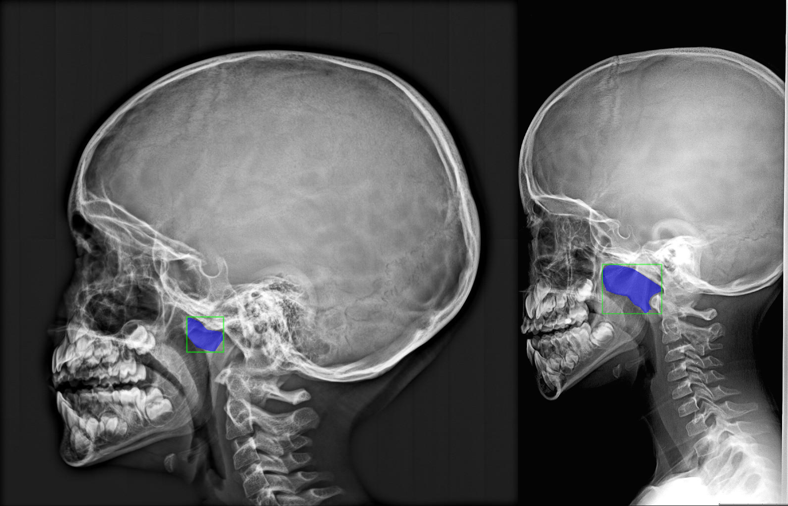

# **latxraynet**

<p align="center">
  
</p>

A Python package for binary classification and segmentation of lateral xray images, providing utilities for data processing, modeling, and visualization.

This repository is designed specifically for small datasets (≈600–1000 images). It focuses on robust transfer learning, CNN / hybrid CNN–Transformer models, and training strategies that improve AUC.


## **Features**

- Supports PyTorch-based models and torchvision utilities
- Preprocessing and augmentation using `albumentations`
- Segmentation models support via `segmentation-models-pytorch`
- Easy integration with X-ray datasets using `torchxrayvision`
- Helper functions for data handling and visualization (`numpy`, `pandas`, `matplotlib`)
- Progress tracking with `tqdm`


## **Installation**

```bash
cd latxraynet
pip install e .
```


## **Run Experiments**

### **1. Data Preparation**

Before running any experiments, you must prepare the dataset.

Your dataset must follow the directory structure below:
```bash
data/
└── 2026/
    ├── 1 image/
    │   └── *.png / *.jpg      # images with one xray
    ├── 2 images/
    │   └── *.png / *.jpg      # images with two xrays
    ├── Masked data/
    │   └── 2026.v1i.sam2      # masks from Roboflow (SAM2 format)
    └── ORL-2026.xlsx          # Labels and metadata

```

 - Images are stored in 1 image/ and 2 images/
 - Masks are stored in Masked data/ and must follow SAM2 format
 - Labels and metadata are provided in ORL-2026.xlsx


To prepare the dataset, run:
```bash
python3 run_experiments/prepare_dataset.py
```

This script:
  - Validates the dataset structure
  - Aligns images, masks, and labels
  - Store masks as png at `data/2026/xray_masks`
  - Preprocess and Store images (with just one xray) at `data/2026/xray_images`
  - Filter the labels and store them at `data/2026/labels.csv`


### **2. Running Experiments**
Once the dataset is prepared, you can run different experiments located in the `run_experiments/` folder.

To run an experiment:
```bash
python3 run_experiments/<experiment_file>.py
```

Example:
```bash
python3 run_experiments/1_first_approach.py
```

Each experiment script typically defines:
  - Model architecture
  - Training configuration
  - Evaluation metrics (e.g., ROC-AUC, accuracy)
  - Plot results and save them in `results/<experiment_file>/` folder

For experiments with `radimagenet` weights, you need to install them from [here](https://huggingface.co/Lab-Rasool/RadImageNet/tree/main) and put them in `latxraynet/weights`.


### **⚠️ Notes**
  - Make sure you are using the correct Python environment
  - Always run `prepare_dataset.py` at least once before launching experiments
  - This code is for **research purposes only** and **not for clinical use**.


## **Contact**
For questions or additional information, please contact:

📧 **Email:** [alirida.sahili@gmail.com](mailto:alirida.sahili@gmail.com)